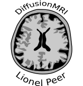

<p align="center">
  
</p>

# DiffusionMRI
Welcome to the DiffusionMRI repository! This repository was created as part of a semester thesis during the fall semester of 2023 at ETH Zurich.

The goal of this repo is to unite models and approaches for conditioning DDPMs (denoising diffusion probabilistic models) on the inverse problem of accelerated MRI.

## Getting Started
Everything to get you started you will find in the documentation of the [DiffusionMRI documentation](https://liopeer.github.io/diffusionmodels/index.html). Feel free to raise issues or get in touch if you would like to contribute.

## Cluster Commands
make sure that `log` folder exists
```bash
sbatch --job-name=NAME --output=log/%j.out --gres=gpu:1 --mem=10G subscript.sh SCRIPT_PARAMS
```
```bash
srun --time 10 --partition=gpu.debug --constraint='titan_xp|geforce_gtx_titan_x' --gres=gpu:1 --pty bash -i
```

## VSCode Remote Troubleshooting
### Repeated Password Query
[UChicago-VSCode Remote](https://howto.cs.uchicago.edu/techstaff:vscode)